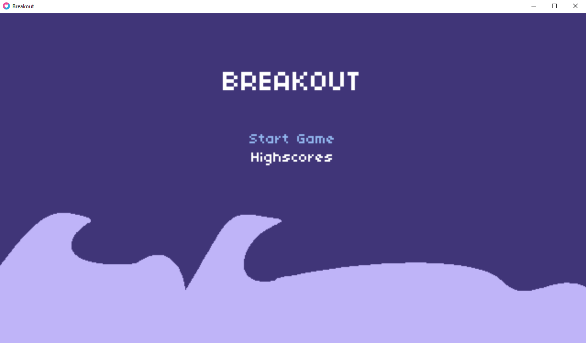
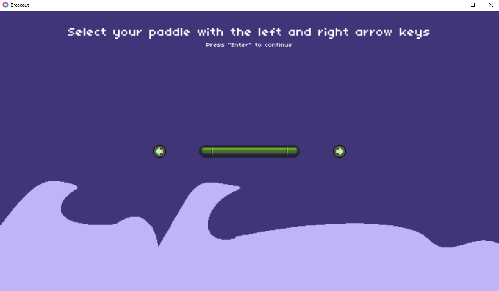
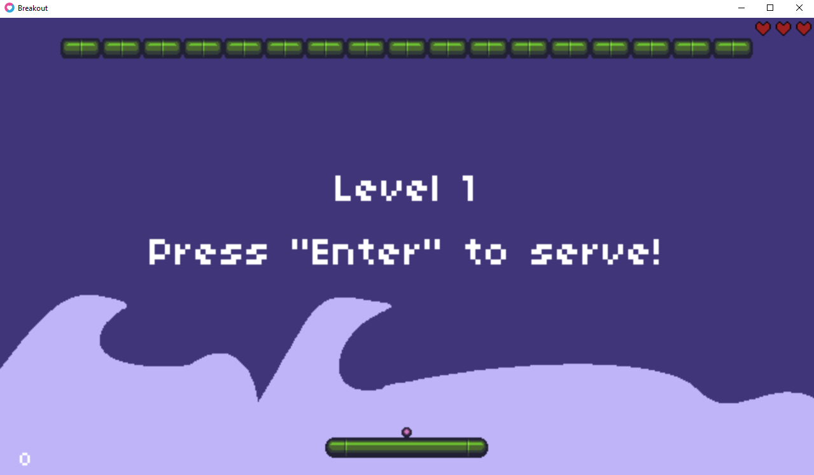
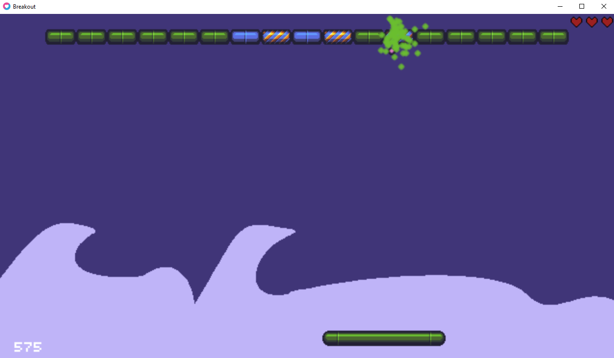
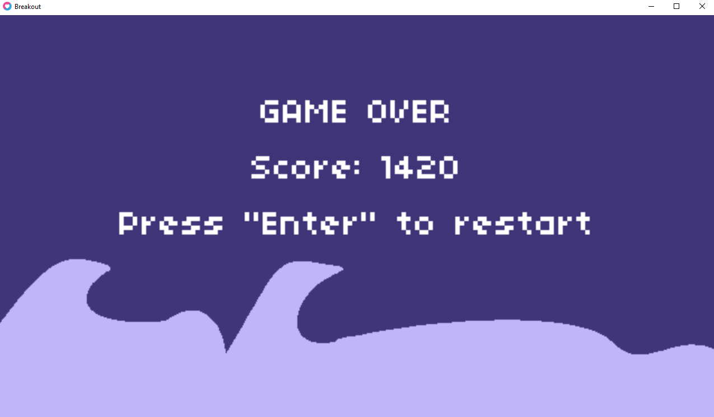
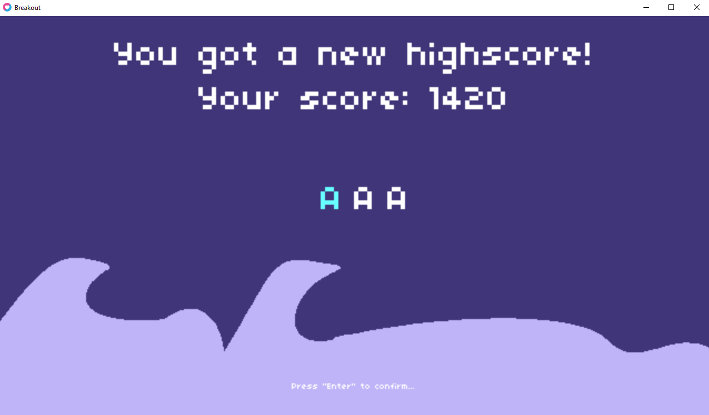
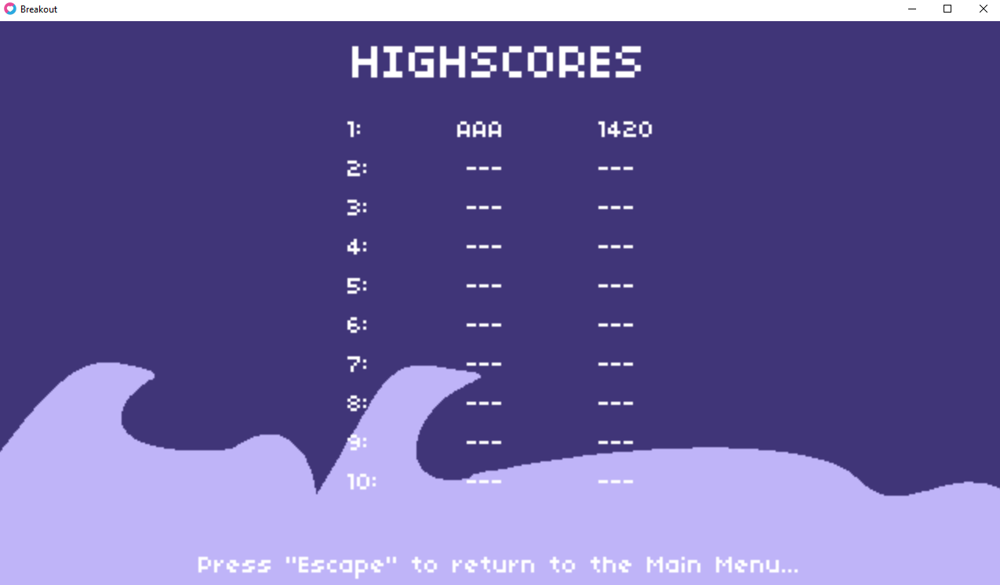
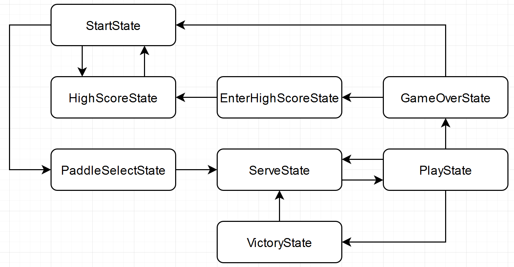

# Breakout

Breakout is an arcade game developed and published by Atari, Inc., and released on May 13, 1976. It was conceptualized by Nolan Bushnell and Steve Bristow, influenced by the seminal 1972 Atari arcade game Pong, and built by Steve Wozniak.

Local game files for the game's highscore are kept in the folders shown in https://love2d.org/wiki/love.filesystem

For example, in Windows, the files are created in `%appdata%\breakout\` after the game is first launched.

To open the AppData folder on Windows 10:

    Open File Explorer/Windows Explorer.
    Type %AppData% into the address bar and hit enter.

# Downloading the Game

You can download the latest release of the game by following the instructions posted at https://github.com/JeremyLoh/Breakout/releases

# Game Screenshots

# Learning points

1. Sprite Sheets

   Sprite sheets already exist since the first days of computer games. The idea is to create one big image that contains all animations of a character instead of dealing with many single files.

   https://www.codeandweb.com/texturepacker/tutorials/how-to-create-a-sprite-sheet

1. Procedural Layouts
1. Managing State
1. Levels
1. Player Health
1. Particle Systems
1. Collision Detection Revisited
1. Persistent Save Data

## Breakout State Flow

## Credit for music:

- http://freesound.org/people/joshuaempyre/sounds/251461/
- http://www.soundcloud.com/empyreanma

## Credit for graphics:

Some of the graphics, `hearts.png`, `background.png`, `arrows.png` were made in Aseprite: https://www.aseprite.org/

The remaining graphics were obtained from:

- https://opengameart.org/users/buch

## Libraries used (in `lib`)

1. `class.lua` - Matthias Richter (vrld)

   https://github.com/vrld/hump/blob/master/class.lua

1. `push.lua` - Ulysse Ramage (Ulydev)

   A simple resolution-handling library for LÖVE

   `push` is a simple resolution-handling library that allows you to focus on making your game with a fixed resolution.

   https://github.com/Ulydev/push
